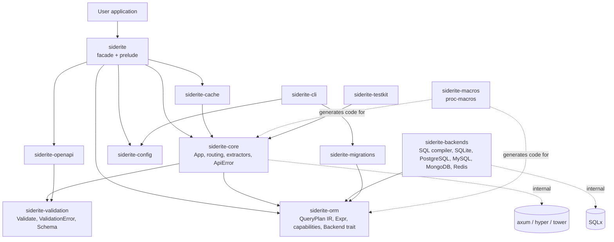
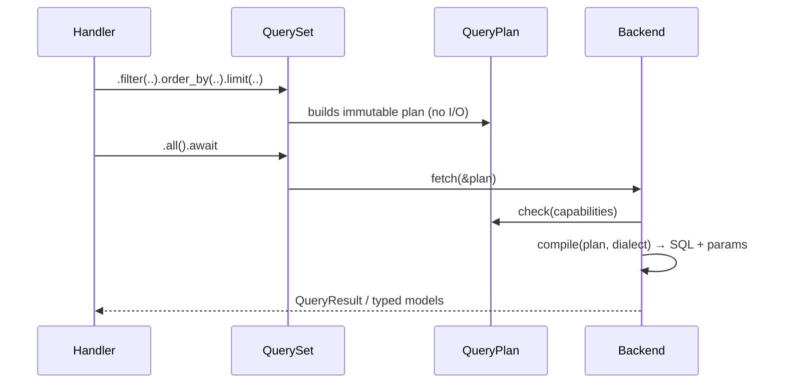

# siderite Architecture

`siderite` is an async-first Rust web framework. It takes its API ergonomics from FastAPI, its validation model from Pydantic v2 and its ORM ergonomics from the Django ORM. It favours **compilable, idiomatic Rust** over Python look-alike syntax: where a Python feature has no natural Rust mapping, we design a Rust equivalent and document how it differs.

> Status: **Phase 6 (production tooling) complete, pre-alpha**. The table in [Crate map](#crate-map) lists the crates and what each one owns.

## Crate map



| Crate | Owns | Status |
|---|---|---|
| `siderite` | Public facade, `prelude` | Implemented |
| `siderite-core` | `App`, own `Handler`/extractor/response traits, DI, middleware, lifespan, WebSockets, forms, headers/cookies, background tasks, static files, RFC 7807 errors, security schemes | Implemented |
| `siderite-validation` | `Validate`, structured `ValidationError`, rules, constrained newtypes, `Schema` + `SchemaRegistry` | Implemented: pipeline, hooks, dump options, constrained types |
| `siderite-orm` | `Model`, `QuerySet`, relations, transactions, signals, database routing, `QueryPlan` IR, `Expr`, capabilities | Implemented |
| `siderite-backends` | Dialect-aware SQL compiler and executors: SQLite, PostgreSQL, MySQL; MongoDB (supported QuerySet subset); Redis key/hash/set client | Implemented |
| `siderite-macros` | Route attributes, `routes![]`, `#[derive(Model, Validate, Schema)]`, `#[model_hooks]`, `#[receiver]` | Implemented |
| `siderite-openapi` | Typed OpenAPI 3.1 model, document builder, Swagger UI / ReDoc | Implemented |
| `siderite-migrations` | Migration graph, operations, autodetector, schema editor (PostgreSQL, SQLite, MySQL), executor | Implemented |
| `siderite-config` | Layered configuration (defaults, TOML, environment, overrides), `Secret`, `init_tracing` | Implemented |
| `siderite-cache` | `Cache` trait, in-memory LRU, Redis cache, `RouteCache` middleware | Implemented |
| `siderite-cli` | `AppCli` (`run`, `routes`, `check`, `dbshell`, migrations) and the standalone `siderite` binary | Implemented; `makemigrations` runs from the app binary |
| `siderite-testkit` | `TestClient` (in-process), `TestDatabase` fixtures and isolation, lifespan-aware `start`/`shutdown` | Implemented |

### Dependency rules

1. **The ORM has no HTTP knowledge.** `siderite-orm` does not depend on `siderite-core`. The core crate implements `From<OrmError> for ApiError`; the orphan rule allows this because core owns `ApiError`.
2. **Schema metadata lives in validation.** `Schema`/`SchemaObject` sit in `siderite-validation` so that core (request bodies) and openapi (documents) share one definition without a cycle.
3. **Backends depend on the ORM, never the reverse.** The ORM defines the `Backend` trait and the capability model; each backend implements them.
4. **HTTP traits are siderite's own.** `FromRequestParts`, `FromRequest`, `IntoResponse` and `Handler` carry `describe` hooks, so OpenAPI is derived from handler signatures and custom extractors document themselves. See [ROUTING.md](ROUTING.md) and [OPENAPI.md](OPENAPI.md).
5. **Axum and SQLx are internal.** Public types are siderite newtypes (`Json`, `Path`, `Query`, `State`, `MethodRouter`, …). Users can therefore upgrade axum or SQLx without breaking changes, and non-SQL backends are not second-class citizens.

## Key architectural decisions

### A. Query expression API: typed field constants, not a filter macro

```rust
User::objects(&db)
    .filter(User::name.icontains("john").or(User::email.ends_with("@example.com")))
    .order_by(User::name.asc())
```

`#[derive(Model)]` generates one associated constant per field:
`pub const name: Field<User, String>`. The type parameters encode two things:

* The **model**, so a `Field<Post, _>` cannot be used by mistake in a `User` query.
* The **Rust type**. Lookups are inherent methods that exist only where they make sense. `icontains` exists only on `Field<M, String>`, and comparison operands must implement `Operand<M, T>`. That means `User::age.eq("x")` fails to **compile**.

We rejected a `filter!(User, name__icontains = "john")` macro. The typed-constant API gives IDE completion, rustdoc, and ordinary compiler errors. A macro would still have to generate these same constants in order to validate field names. Django `__` traversal is `Post::author.join(Author::name)` (and further hops on the joined handle).

Implemented now: `siderite_orm::expr::{Expr, Field, Operand, Lookup}`.

### B. Model metadata generation

`#[derive(Model)]` generates, all at compile time:

* **Typed field markers**: the `Field<M, T>` constants from decision A.
* **Static metadata**: `const META: ModelMeta` with the table name, fields (column, SQL type family, nullability, constraints), indexes, unique/check constraints and ordering. It is a `&'static` data structure with no runtime registration.
* **Relation metadata**: FK target, `on_delete` policy, related name. The target is referenced by type, so a typo in a model name is a compile error.
* **Schema metadata**: models can also `#[derive(Schema)]`; `ForeignKey<T>` describes itself as `T`'s primary key.
* **Migration metadata**: the migration autodetector diffs `ModelMeta` snapshots, so migrations and the ORM share one source of truth.

### C. Backend capability detection

Unsupported features fail at the earliest possible point:

| When | Mechanism | Example |
|---|---|---|
| Compile time | Typed APIs; lookups exist only on suitable types | `icontains` on an `i64` field |
| Query construction / compile | `QueryPlan::required_features()` checked against `BackendCapabilities` before any I/O | `select_for_update()` on SQLite → `BackendCapabilityError::RowLockingUnsupported` |
| Execution | Server/version limits discovered at runtime | older SQLite without window functions |

Nothing is silently ignored. Capabilities are richer than booleans where needed: `TransactionSupport { None, Flat, Savepoints }` and `RowLocking { None, Basic, Full }`.

### D. Connection ownership

* An application registers backends under **aliases** (`"default"`, `"analytics"`). They are stored as `Arc<dyn Backend>` in a `Databases` registry (`App::database` / `App::databases`); a `DatabaseRouter` picks the alias per model. See [DATABASE_ROUTING.md](DATABASE_ROUTING.md).
* Handlers receive a `Db` handle through dependency injection. It is a cheap clone of the pool handle and never a raw SQLx pool.
* Transactions are **scoped closures**: `db.transaction(|tx| async move { … }).await`. The closure receives a `Db` bound to the open transaction (the same type as the pool handle). Commit happens on `Ok`, rollback on `Err` or panic-unwind. Nested calls become savepoints only when `TransactionSupport::Savepoints` is declared.
* `QuerySet::using(&Db)` rebinds a queryset to a handle you already hold. `Databases::using::<M>(alias)` bypasses the router. A queryset holds exactly one `Db`; combining querysets (or nesting a subquery) bound to different databases is `QueryError::InvalidPlan` before any I/O.

### E. Query result decoding

* Every backend returns `QueryResult { rows: Vec<Row> }`. A `Row` holds ordered `(column, Value)` pairs, where `Value` is a closed, backend-neutral enum.
* Typed model decoding is `Model::from_row`, generated by `#[derive(Model)]`. It reads by column name and returns `QueryError::Decode` instead of panicking.
* Dynamic projections (`values()`, annotations, aggregates) stay as `Row`. `values_list::<(A, B)>()` decodes into tuples through the same trait.
* Bind parameters are always `Value`s. They are never interpolated into SQL and never logged by default.

## Query pipeline



See [QUERY_PLAN.md](QUERY_PLAN.md) and [BACKENDS.md](BACKENDS.md).

## Error architecture

| Error | Crate | HTTP mapping |
|---|---|---|
| `ValidationError` | validation | 422 with `errors` extension |
| `QueryError::DoesNotExist` | orm | 404 |
| `QueryError::MultipleObjectsReturned` | orm | 500 |
| `BackendCapabilityError` | orm | 501 |
| `BackendError::Constraint` | orm | 409 (the detail is logged, not returned) |
| `OrmError::Signal` | orm | 500 (the text is logged, not returned) |
| `OrmError::UnknownDatabase` | orm | 500 (a missing alias is a configuration error) |
| other `BackendError` | orm | 500 (the detail is logged, not returned to the client) |
| `ApiError` | core | Rendered as RFC 7807 `application/problem+json` |

Library code has no `unwrap`/`expect`: clippy `unwrap_used` and `expect_used` are denied workspace-wide. Every crate declares `#![forbid(unsafe_code)]`.
